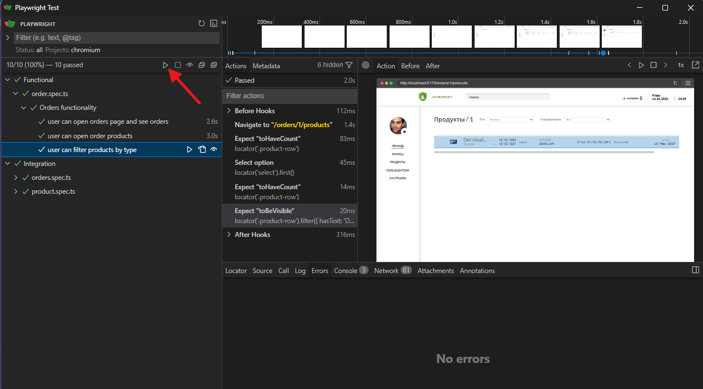

# Dzencode Test Task

## SPA Application: Orders & Products

The application consists of two parts:

* **Backend** — REST API in Node.js and Express.js.
* **Frontend** — Single-page application in React + Vite.
* **Database** — MongoDB for data storage.
* **WebSocket** — Socket.IO for displaying the number of online users.
* **Docker** — the application can be run in containers
* **Host** — http://34.53.176.159/orders

---

### 1. Installing and Running the Backend

Change to the Backend directory:

```bash
cd back
```

Install dependencies:

```bash
npm install
```

To run the Backend in development mode:

```bash
npm run dev
```

After launching, the server will be accessible at:

```text
http://localhost:5000
```

### 2. Installing and Running the Frontend

Open a new terminal window and change to the Frontend directory:

```bash
cd front/dzencode-test
```

Install dependencies:

```bash
npm install
```

To run the Frontend in In development mode:

```bash
npm run dev
```

After launch, the application will be available at:

```text
http://localhost:5173
```

### 3. Running Playwright Tests

Playwright is used to run automated E2E tests.

Go to the test directory:

```bash
cd front/dzencode-test
```

If Playwright browsers are not yet installed, run

```bash
npx playwright install
```

To run tests interactively

```bash
npx playwright test --ui
```

Run the tests



## Implemented

As part of the test task, the **Orders & Products** SPA application was developed for managing receipts, products, and their groups. The app allows you to view a list of receipts, the number of associated items, product groups, and detailed information about each item, including serial number, type, specifications, photo, warranty period, and price in various currencies. Navigation between app sections is implemented, and the interface is localized into Russian and English.

The app's backend is built on Node.js and Express.js using MongoDB and Mongoose. The architecture is divided into controllers, services, routes, and data models. Authorization is implemented using JWT, middleware for authorization checking, handling uploaded images, and a REST API for interacting with receipts and items.

Socket.IO is used to display the number of users online in the app. The number of active sessions is automatically updated when users connect and disconnect.

The frontend is developed using React and Vite. React Router is used for navigation, state management is implemented with Redux, and interaction with the backend is handled via the REST API and Socket.IO. The interface is adapted to the main scenarios of working with receipts, products, and groups.

To test key user scenarios, automated E2E tests using Playwright have been added, with the ability to run and debug them using Playwright UI Mode.